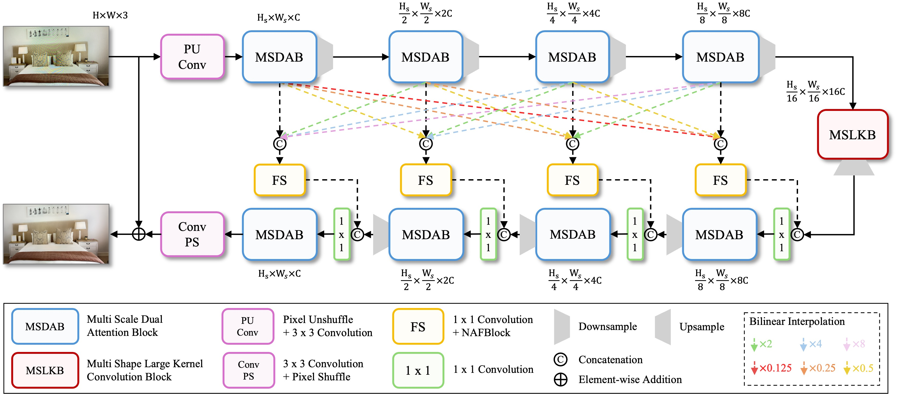

<h1 align="center">
Moiré Zero: An Efficient and High-Performance  
Neural Architecture for Moiré Removal
</h1>

Official github for "Moiré Zero: An Efficient and High-Performance Neural Architecture for Moiré Removal"

## ✏️ Abstract
Moiré patterns, caused by frequency aliasing between fine repetitive structures and a camera sensor’s sampling process, have been a significant obstacle in various real-world applications, such as consumer photography and industrial defect inspection. With the advancements in deep learning algorithms, numerous studies---predominantly based on convolutional neural networks---have suggested various solutions to address this issue. 
Despite these efforts, existing approaches still struggle to effectively eliminate artifacts due to the diverse scales, orientations, and color shifts of moiré patterns, primarily because the constrained receptive field of CNN-based architectures limits their ability to capture the complex characteristics of moiré patterns.
In this paper, we propose MZNet, a U-shaped network designed to bring images closer to a ‘Moiré-Zero’ state by effectively removing moiré patterns. It integrates three specialized components: Multi-Scale Dual Attention Block (MSDAB) for extracting and refining multi-scale features, Multi-Shape Large Kernel Convolution Block (MSLKB) for capturing diverse moiré structures, and Feature Fusion-Based Skip Connection for enhancing information flow. Together, these components enhance local texture restoration and large-scale artifact suppression.
Experiments on benchmark datasets demonstrate that MZNet achieves state-of-the-art performance on high-resolution datasets and delivers competitive results on lower-resolution dataset, while maintaining a low computational cost, suggesting that it is an efficient and practical solution for real-world applications.

